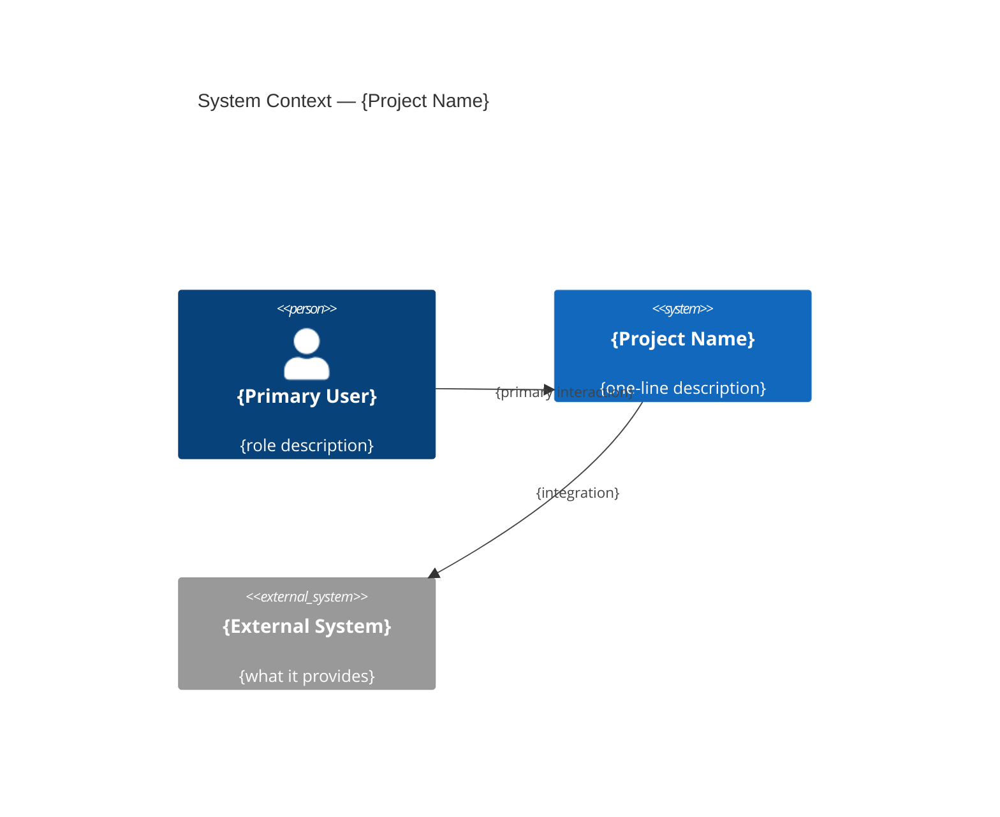

# /solution — Technical Architecture Design

Translates a product vision into a technical architecture. Reads `.claudius/product.md` (the target state), conducts a technical interview, researches best practices, and writes `.claudius/solution.md` as the living architecture document.

This is **Stage 2** of the development lifecycle. It reads the output of `/product` (Stage 1) and produces input for `/design` (Stage 2.5).

## Usage
```
/solution              → design architecture, reads .claudius/product.md
```

## Workflow

### 1. Read the Product Vision

Read the product target state file:

```bash
Read .claudius/product.md
```

Parse the product vision to identify:
- Core capabilities and primary workflows (what the system must do)
- Platform and UX decisions (web, mobile, CLI, API)
- Data entities and relationships (what's stored)
- External integrations (what connects)
- Non-functional requirements (performance, security, scale)
- Productization decisions (SaaS, monorepo, marketing site)

Do not revisit product decisions. If the product vision says "web app with email auth", the solution skill decides *how* to implement email auth, not *whether* to have it.

### 2. Research & Ideation

**First**, read `references/bias.md` to understand the user's technology preferences. These biases should inform your defaults and proposals throughout the interview.

Then conduct a multi-phase exploration before starting the interview.

#### 2a. Landscape Research

Use the Agent tool to spawn multiple parallel research subagents for speed:

| Research Area | What to Look For |
|---------------|-----------------|
| Stack options | Framework comparisons for the chosen platform, recent benchmarks, community health |
| Hosting | Pricing, scaling characteristics, deployment complexity for the expected load |
| Similar systems | Open-source projects solving similar problems — what architecture did they choose? |
| Architecture precedents | Find 2-3 open-source or well-known systems solving similar problems; analyze their architecture choices and what worked/failed |
| Platform pathways | When product says "mobile" or "cross-platform": current state of React Native/Expo vs Flutter vs native, recent stability/performance data, app store requirements |
| Tablet/TV surfaces | When mobile is in scope: evaluate whether the product benefits from tablet-optimized layouts (master-detail, split views, Apple Pencil) and whether a tvOS/Android TV surface makes sense (content-consumption products) |
| Codebase (if existing) | Existing patterns, established abstractions, tech debt to work with or around |

When mobile is in scope, ask via questionnaire (`AskUserQuestion`):
- "Will this be used on tablets? If so, should it have a tablet-optimized layout (sidebar + content) or just scale up the phone UI?"
- "Is there a TV/living-room use case? (e.g., media consumption, dashboards, ambient displays)"

#### 2b. Options Exploration

Based on research, identify 2-3 viable architectural paths. For each path:
- **Name it** — a short descriptor
- **Core approach** — what defines this path
- **Pros/cons** — tradeoffs relative to the product requirements
- **Complexity estimate** — relative effort (low/medium/high)

Example: "Path A: Next.js monolith (simple, fast to build, limited mobile story) vs Path B: API-first with React Native + Hono backend (mobile-native, more complexity, better UX) vs Path C: Progressive Web App (single codebase, offline-capable, limited native APIs)"

Present options to the user with `AskUserQuestion` before proceeding to the detailed interview. This prevents premature convergence on one path.

#### 2c. Deep-Dive on Chosen Path

Once the user picks a direction, research that specific path thoroughly:
- Current best practices and common pitfalls
- Recent framework changes and version-specific capabilities
- Example: if mobile chosen, research Expo SDK capabilities, EAS build pricing, app store review timelines

**Key principle:** The interview (Step 3) now starts with a chosen direction rather than exploring from scratch. Questions are sharper because the research already narrowed the field.

### 3. Technical Interview

Ask questions using `AskUserQuestion` in rounds of 2-3 questions. The interview covers these architectural dimensions:

| Dimension | Key Questions |
|-----------|--------------|
| System Boundaries | What are the major services/modules? Monolith vs services? Where do they communicate? |
| Data Architecture | Database choice, schema design principles, caching strategy, data migration approach |
| API Design | REST vs GraphQL vs tRPC, endpoint structure, versioning, rate limiting |
| Auth Architecture | Authentication mechanism, authorization model (RBAC, ABAC), session management |
| Infrastructure | Hosting, CI/CD, environments, monitoring, logging, alerting |
| Security | Data sensitivity, encryption at rest/transit, secrets management, compliance |
| Integration Patterns | External APIs, webhooks, event-driven components, message queues |
| Error Handling | How errors propagate, retry strategies, graceful degradation |
| Testing Strategy | Unit/integration/e2e split, testing infrastructure, CI requirements |
| Performance | Expected load, scaling strategy, bottleneck analysis, CDN/edge |
| Developer Experience | Local dev setup, hot reload, debugging, documentation approach |

**Interview behaviors:**
- **Propose informed defaults** — "Based on your requirements, I'd suggest PostgreSQL with Drizzle ORM — relational data, complex queries, type-safe schema. Does that work?" Don't ask open-ended "which database?" when the requirements clearly point to an answer.
- **Surface tradeoffs** — "tRPC gives you end-to-end type safety but locks you to TypeScript clients. REST is more flexible but requires manual type maintenance. Given your product is web-only, tRPC seems like a win — agree?"
- **Flag risks early** — "Real-time collaboration typically needs WebSockets or SSE. That rules out pure serverless hosting. Worth discussing infrastructure implications now."
- **Respect existing codebase** — if there's an existing project, align with its patterns unless there's a strong reason to diverge.

### 4. Build Internal Checklist

Track coverage across architectural dimensions. Every dimension must be addressed — either through explicit discussion or informed inference.

Mark inferences with `[inferred]` and confirm with the user at synthesis time.

### 5. Synthesize Architecture Document

Read `references/architecture-template.md` and merge all decisions into the template.

**Writing style:**
- **Decisions, not options** — "PostgreSQL 16 — relational data, complex queries, mature ecosystem" not "Consider PostgreSQL or MongoDB based on your needs"
- **Rationale in one line** — every choice has a "because" that traces to a product requirement
- **Diagrams over prose** — text-based architecture diagrams, data flow diagrams, component relationship diagrams
- **Tables for structured data** — technology choices, API endpoints, environment configs
- **Concrete over abstract** — name components, specify versions, define boundaries

### 5b. Generate Context Diagram

Generate a **Mermaid C4 Context diagram** showing the system boundaries, external actors, and integrations. This diagram goes at the top of the Architecture Overview section in `solution.md`.



Include:
- All user roles from `product.md` as `Person` nodes
- The system being built as the central `System` node
- All external integrations (auth providers, payment, email, storage, APIs) as `System_Ext` nodes
- Relationships labeled with the interaction type

This diagram answers: "What is this system, who uses it, and what does it connect to?" — the most common question when someone new encounters the project.

If the Mermaid Chart MCP is available, use it to validate and render the diagram.

### 6. Present for Approval

Use `AskUserQuestion` with a `markdown` preview on the "Approve" option showing the full architecture document. Two options:

- **Approve** — with markdown preview of the complete architecture
- **Revise** — user wants to change or add something

If the user chooses "Revise", ask what they want to change, update, and re-present. Repeat until approved.

### 7. Product Delta Assessment

After the architecture is finalized but before writing, evaluate what product-level changes emerged during the technical interview. Categories:

- **Scope trimming** — features that are technically infeasible or disproportionately expensive for v1
- **Scope expansion** — capabilities that architecture naturally enables at near-zero cost
- **Platform shifts** — "you said web, but your use case screams mobile-first" type revelations
- **Strategy changes** — distribution, monetization, or audience implications from technical constraints
- **New constraints** — performance limits, security requirements, or compliance needs surfaced by architecture

**If delta is non-empty:**
1. Present the delta to the user: "During architecture, these product-level changes surfaced: [list]"
2. Ask via `AskUserQuestion`: "Should I update the product vision to reflect these?" (Yes → write handoff / No → proceed)
3. If yes: write the delta items into a `## Architecture-Informed Revisions` section at the bottom of `.claudius/product.md` as a handoff note, then suggest: "Run `/product` to incorporate these revisions into the full vision."

**If delta is empty:** skip, proceed to write.

### 8. Write Target State File

On approval:

**Write `.claudius/solution.md`** — this is the sole output artifact.

### 9. Report

```
.claudius/solution.md written.
```

If a product delta was generated in Step 7:
```
Product-level changes surfaced during architecture: [brief list].
These have been written to `.claudius/product.md` under "Architecture-Informed Revisions".
Run `/product` to incorporate them into the full vision.
```

```
Next: `/design` to design the user experience and visual system.
```

## Delta Mode

When `.claudius/solution.md` has existing content:
1. Read `.claudius/solution.md`
2. Compare against the current checklist of dimensions
3. Identify gaps, shallow areas, and potentially stale decisions
4. Only ask questions about what's missing or needs updating
5. Preserve well-written sections, enhance gaps

## Rules

- **Sole output is `.claudius/solution.md`** — the target architecture file that evolves with the product, no GitHub Issue
- **Read `.claudius/product.md` first** — the product target state file is the input
- **Product decisions are settled** — don't revisit what `/product` decided. "Should we have auth?" is answered. "How should auth work?" is this skill's job.
- **Every dimension must be addressed** — asked directly or inferred and confirmed
- **Research actively** — don't ask questions in a vacuum; use web search to inform the discussion
- **Diagrams are required** — at minimum: component diagram, data flow, and infrastructure topology
- **No PlanMode** — this skill produces a design document, not code
- **Self-contained output** — a reader should understand the full architecture from this file alone
- **Surface product-level discoveries** — don't silently absorb scope changes. If architecture reveals something that changes the product vision, flag it in the product delta step.

## Anti-Patterns (Do Not)

- **Don't revisit product decisions** — `.claudius/product.md` is the source of truth for what to build
- **Don't over-architect** — match complexity to the product requirements. A side project doesn't need microservices.
- **Don't assume enterprise patterns** — not every project needs event sourcing, CQRS, or a message queue. Ask about scale before proposing infrastructure.
- **Don't skip developer experience** — how developers run this locally matters as much as how it runs in production
- **Don't ignore existing codebase** — if there's an existing project, the architecture must account for what already exists
- **Don't write implementation details** — "Use PostgreSQL with Drizzle ORM" is architecture. "Create a users table with columns id, email, password_hash" is specification (Stage 3).
- **Don't propose without rationale** — every technology choice must trace to a product requirement or technical constraint
- **Don't silently resolve product ambiguity** — if architecture reveals a product gap (scope that's infeasible, capabilities that come free, platform mismatches), flag it in the product delta step rather than quietly absorbing it into the architecture

## Success Criteria

1. **Complete coverage** — every architectural dimension is addressed with a decision and rationale
2. **Traceable to product** — every architecture choice connects to a product requirement
3. **Diagrams are clear** — someone can understand the system structure from diagrams alone
4. **Technology choices are justified** — no "we chose X because it's popular" without connecting to requirements
5. **Risks are surfaced** — known technical risks with mitigation strategies
6. **Research-informed** — decisions reflect current best practices, not just convention
7. **Right-sized** — architecture complexity matches product complexity
8. **Actionable for /spec** — the spec skill can decompose this into domain specifications without ambiguity
