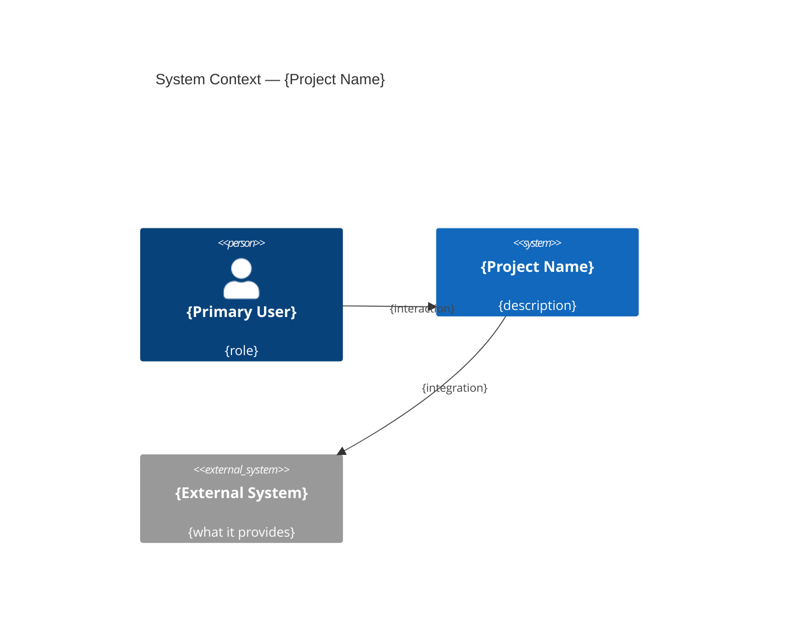

# Architecture Template — Solution Issue

Structure the solution issue body using this template. Fill every section. Use text-based diagrams for visual architecture.

**Writing rules:** This document is read by the /spec skill and by developers. Be precise. State decisions with rationale. Use diagrams. Cut ambiguity.

---

```markdown
# {Project Name} — Technical Architecture

**Product Issue:** #{product-issue-number}

## Architecture Overview

### System Context



### Component Diagram

```
{Text-based component diagram showing major system boundaries,
services/modules, and their communication paths}
```

**Style:** {monolith | modular monolith | microservices | serverless | hybrid}
**Rationale:** {why this style fits the product requirements}

## Technology Stack

| Layer | Choice | Rationale |
|-------|--------|-----------|
| Language | {e.g., TypeScript 5.x} | {why — type safety, ecosystem, team familiarity} |
| Framework | {e.g., Next.js 15} | {why — SSR, API routes, React ecosystem} |
| Database | {e.g., PostgreSQL 16} | {why — relational data, complex queries} |
| ORM | {e.g., Drizzle} | {why — type-safe, lightweight, migrations} |
| Auth | {e.g., Better Auth} | {why — flexible, self-hosted, OAuth support} |
| Hosting | {e.g., Vercel} | {why — edge network, zero-config deploys} |
| CI/CD | {e.g., GitHub Actions} | {why — integrated, free tier sufficient} |
| Monitoring | {e.g., Sentry + Axiom} | {why — error tracking + log aggregation} |

## System Components

### {Component Name}
**Responsibility:** {what it owns — one sentence}
**Boundaries:** {what it does NOT handle}
**Communicates with:** {other components, via what protocol}

### {Component Name}
**Responsibility:** {description}
**Boundaries:** {exclusions}
**Communicates with:** {dependencies}

## Data Flow

```
{Text-based data flow diagram showing how data moves through the system
for the primary user workflow}
```

### Primary Flow: {e.g., "User creates a recipe"}
1. {Client sends POST /api/recipes with body}
2. {API validates, writes to PostgreSQL}
3. {Background job processes images}
4. {Client receives 201 with recipe ID}

## Data Architecture

**Database:** {choice + version}
**Strategy:** {single DB | read replicas | sharding | multi-tenant}

**Key design decisions:**
- {decision} — {rationale}
- {decision} — {rationale}

**Migration approach:** {tool, strategy for schema changes}
**Caching:** {what's cached, where, TTL strategy, invalidation}

## API Design

**Style:** {REST | GraphQL | tRPC | gRPC}
**Format:** {JSON | protobuf}
**Versioning:** {URL path | header | none for internal}

**Endpoint structure:**
```
{High-level endpoint grouping — not full spec, just shape}
/api/auth/*        → authentication flows
/api/users/*       → user management
/api/{resource}/*  → CRUD for primary entities
```

**Error format:**
```json
{
  "error": { "code": "VALIDATION_ERROR", "message": "...", "details": [...] }
}
```

## Authentication & Authorization

**Auth mechanism:** {JWT | session | OAuth | magic link}
**Session storage:** {cookie | localStorage | httpOnly cookie}
**Authorization model:** {RBAC | ABAC | simple ownership}

**Roles & permissions:**
| Role | Can do |
|------|--------|
| {role} | {permissions} |

**Token lifecycle:** {creation, refresh, expiry, revocation}

## Infrastructure

```
{Text-based infrastructure topology diagram}
```

**Environments:**
| Env | Purpose | URL pattern |
|-----|---------|-------------|
| Development | Local dev | localhost:3000 |
| Preview | PR previews | {branch}.preview.domain |
| Production | Live | domain.com |

**Scaling strategy:** {vertical | horizontal | auto-scale | edge}
**CDN:** {what's served from edge, what's origin}

## Security

- **Data at rest:** {encryption approach}
- **Data in transit:** {TLS, certificate management}
- **Secrets management:** {env vars, vault, encrypted config}
- **Input validation:** {where, how — zod, joi, manual}
- **Rate limiting:** {strategy, thresholds}
- **CORS:** {policy}
- **CSP:** {content security policy approach}

## Error Handling

**Philosophy:** {fail fast | graceful degradation | circuit breaker}
**Logging:** {structured JSON, log levels, what gets logged}
**Error boundaries:** {how errors propagate, where they're caught}
**Retry strategy:** {what's retried, exponential backoff, max attempts}

## Testing Strategy

| Level | What | Tool | Coverage Target |
|-------|------|------|-----------------|
| Unit | Business logic, utils | {Vitest} | {high} |
| Integration | API routes, DB queries | {Vitest + test DB} | {medium} |
| E2E | Critical user flows | {Playwright} | {key flows only} |

**CI pipeline:** {what runs on PR, what runs on merge}

## Project Structure

```
{Repository layout — monorepo or single app}
apps/
  web/          → marketing site (if needed)
  dashboard/    → authenticated app
packages/
  core/         → shared logic
  cli/          → CLI tool (if applicable)
```
{Or: single app — no monorepo needed. Rationale.}

## Accessibility & Internationalization

- **WCAG level:** {AA | AAA | none}
- **Screen reader support:** {approach}
- **i18n:** {languages, framework — e.g., next-intl}
- **RTL:** {supported or not}

## Developer Experience

**Local setup:** {steps to get running}
**Hot reload:** {what reloads, what requires restart}
**Debugging:** {approach, tools}
**Code style:** {linter, formatter, pre-commit hooks}

## Key Decisions

| Decision | Chose | Over | Because |
|----------|-------|------|---------|
| {what was decided} | {chosen option} | {rejected alternative} | {rationale} |
| {decision} | {choice} | {alternative} | {reason} |

## Risks & Mitigations

| Risk | Impact | Likelihood | Mitigation |
|------|--------|------------|------------|
| {risk} | {H/M/L} | {H/M/L} | {how to address} |

## Open Technical Questions

- {Unresolved technical decision that needs more information}
```
